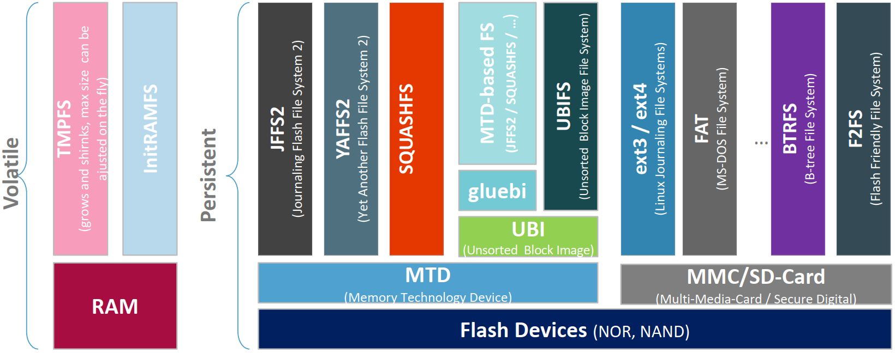

# Filesystem

## 1. De connaître les différents types de systèmes de fichiers ainsi que leurs applications
Pour les systèmes embarqués, il existe deux catégories de systèmes de fichiers :
- volatiles en RAM
- les persitents sur des Flash (NOR et de plus en plus NAND)

Deux technologies principales sont disponible sur les Flash :  
- soit les MTD (Memory Technology Device)
- les MMC/SD-Card (Multi-Media-Card / Secure Digital Card)

## 2. De connaître les caractéristiques des filesystems ext2-3-4, ainsi que les commandes associées

## 3. D’expliquer les différents « files systems » utilisés dans les systèmes embarqués (ext2-3-4, BTRFS, F2FS, NILFS2, XFS, ZFS, …)

## 4. Expliquer les « files system » de type Journal, B_Tree/CoW, log filesystem

## 5. De connaître les caractéristiques du filesystem Squashfs, ainsi que les commandes associées

## 6. De connaître les caractéristiques du filesystem tmpfs, ainsi que les commandes associées

## 7. De connaître les caractéristiques du filesystem LUKS, ainsi que les commandes associées

## 8. Savoir expliquer la gestion des clés de LUKS 42. 

## 9. De connaître les caractéristiques du filesystem InitramFS, ainsi que les commandes associées

## 10. De savoir créer un initramFS